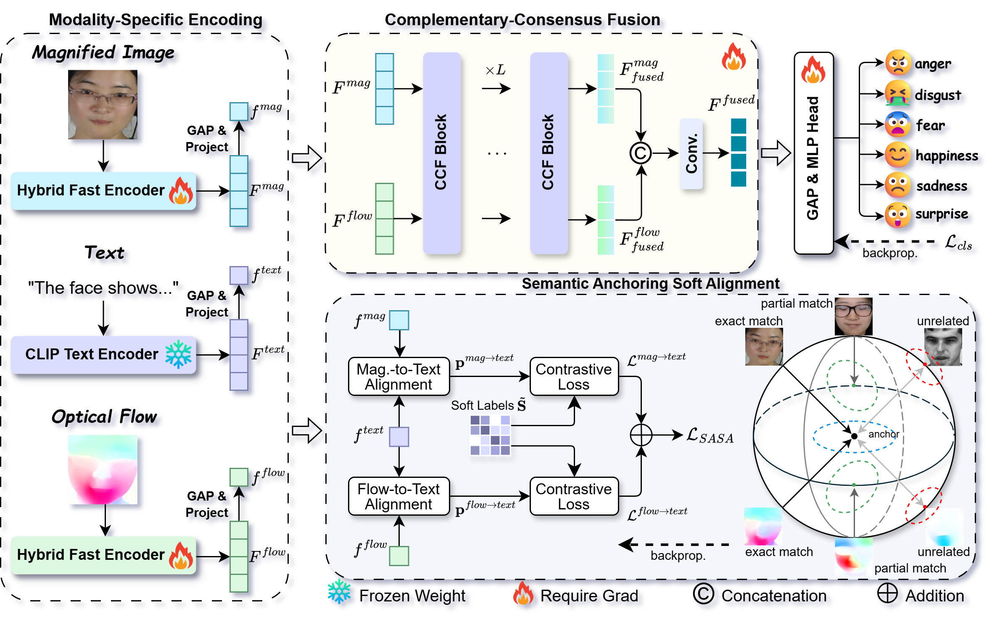

# SAC²-Net: Semantic Anchoring and Complementary-Consensus Fusion for Multimodal Micro-Expression Recognition

Official PyTorch implementation of **SAC²-Net**, a Semantic Anchoring and Complementary-Consensus Network for multimodal micro-expression recognition (MER).

> **Repository status:** The code, pretrained weights, and documentation are being organized for public release. Some resources referenced below will be added progressively.

## Abstract

Micro-expression recognition (MER) is challenging due to subtle facial movements, limited data, and the ambiguous relationship between Action Units (AUs) and emotion categories. Optical flow and motion magnification have been widely used to describe subtle facial dynamics from different perspectives: the former captures local motion displacement, while the latter amplifies weak appearance changes.

In this work, we observe that these two modalities often exhibit asymmetric failure patterns: one modality may become noisy, distorted, or uninformative, while the other still preserves discriminative AU-related evidence. This phenomenon reveals their complementarity but also raises two key challenges for fusion: cross-modal heterogeneity and spatially varying modality reliability.

Motivated by this observation, we propose SAC²-Net, a Semantic Anchoring and Complementary-Consensus Network for multimodal MER, which first aligns visual modalities with semantic anchors and then performs reliability-aware fusion. To reduce cross-modal heterogeneity before fusion, we introduce Semantic Anchoring Soft Alignment (SASA), which converts activated AUs into textual prompts and uses them as stable semantic anchors to align motion-magnified and optical-flow representations. Unlike hard contrastive learning, SASA constructs hierarchical AU-aware soft labels to preserve semantic proximity among samples with overlapping or anatomically related AU patterns.

Based on the aligned representations, Complementary-Consensus Fusion (CCF) first repairs unreliable local evidence through complementary exchange and then enforces a shared spatial focus through consensus refinement. Extensive experiments on five MER benchmarks show that SAC²-Net achieves state-of-the-art or highly competitive performance across coarse-grained, fine-grained, large-scale, and cross-dataset evaluation settings.

<p align="center">
  
</p>

<p align="center">
  <b>Figure 1.</b> Overall architecture of the proposed SAC²-Net.
</p>

## Contents

* [Installation](#installation)
* [Data Preparation](#data-preparation)
* [SASA Pretraining](#sasa-pretraining)
* [Training](#training)
* [Evaluation](#evaluation)
* [Acknowledgements](#acknowledgements)
* [Citation](#citation)

## [Installation](#installation)

### 1. Clone the repository

```bash
git clone https://github.com/pong213/SAC2-Net.git
cd SAC2-Net
```

### 2. Create a Conda environment

```bash
conda create -n sac2net python=3.10 -y
conda activate sac2net
```

### 3. Install dependencies

```bash
pip install -r requirements.txt
```

## Data Preparation

### Preprocessing

SAC²-Net uses the onset and apex frames of each micro-expression sample to construct two visual modalities.

1. Facial regions are aligned and cropped using [MediaPipe](https://github.com/google-ai-edge/mediapipe), and then resized to `224 × 224`.
2. Motion-magnified images are generated using [Learning-based Axial Video Motion Magnification](https://github.com/kaist-ami/Axial-mm).
3. Optical-flow images are estimated using [DecFlow](https://github.com/RIA1159/FacialFlowNet).

Please follow the licenses and instructions of the corresponding projects when preparing these modalities.

### Dataset organization

The datasets are not distributed with this repository. Please obtain them from their official providers and store them outside the source-code directory.

A recommended directory structure is:

```text
datasets/
├── annotation_files/
│   ├── casme2_5cls.xlsx
│   ├── samm_5cls.xlsx
│   ├── casme_cube_4cls.xlsx
│   ├── casme_cube_7cls.xlsx
│   ├── dfme_train.xlsx
│   ├── dfme_test_a.xlsx
│   ├── dfme_test_b.xlsx
│   └── megc2019_cd.xlsx
├── casme2/
├── samm/
├── smic/
├── casme_cube/
├── dfme/
└── megc2019_cd/
```

In the codebase, `casme_cube` denotes the **CAS(ME)³** dataset.

Each processed dataset directory should contain the two visual modalities:

```text
casme_cube/
├── decflow/
│   ├── spNO.181_m_41.jpg
│   └── ...
└── magnification/
    ├── spNO.181_m_41.jpg
    └── ...
```

The value passed to `--dataset_root` should point to the dataset directory containing the `decflow/` and `magnification/` folders.

Processed image files must follow this naming convention:

```text
{Subject}_{Filename}_{Apex}.jpg
```

For example:

```text
spNO.181_m_41.jpg
```

### Annotation files

Annotations are stored as Excel files. Each row corresponds to one micro-expression sample and must contain the fields required by the data loader.

Example (`casme_cube_7cls.xlsx`):

| Subject    | Filename | Onset | Apex | Offset | AU     | Estimated Emotion |
| ---------- | -------- | ----: | ---: | -----: | ------ | ----------------- |
| spNO.181   | m        |    34 |   41 |     46 | 4+L2   | disgust           |

Ensure that the subject identifier, sequence name, apex index, AU notation, and emotion label are consistent with the processed filenames and benchmark configuration.

### AU-to-text prompts

During training, activated AU labels are converted into natural-language descriptions. For each AU, SAC²-Net maintains multiple descriptions covering complementary perspectives, such as anatomical movement and visible appearance. One description is sampled for each activated AU and combined with a randomly selected sentence prefix. This stochastic prompting strategy serves as semantic data augmentation.

The AU prompt templates are stored in:

```text
experiment/utils/au_textual_prompt_templates.json
```

The text branch is used only during training for semantic alignment and is not required during inference.

## SASA Pretraining

The visual encoders can be pretrained using the SASA objective before downstream MER training.

```bash
python pretrain_sasa.py \
    --dataset_annotation_path /path/to/annotations.xlsx \
    --dataset_root /path/to/dataset \
    --output_weights_path ./pretrained_weights/sasa_pretrained_weights.pth \
    --epochs num_epochs \
    --batch_size batch_size \
    --num_workers num_workers \
    --device cuda
```

During SASA pretraining:

* The visual encoders are optimized.
* The SASA projection layers are optimized.
* The CLIP text encoder remains frozen.
* The CCF modules and classification head are removed.

Adjust `--epochs`, `--batch_size` and `--num_workers` according to the actual environment.

We also provide the CK+-pretrained weights ([link](https://)) used in our experiments.
[CK+](https://www.jeffcohn.net/wp-content/uploads/2020/02/CVPR2010_CK2.pdf.pdf) is a Macro-expression dataset and is suitable for transfer learning in our task.

## Training

### LOSO evaluation

Use `train_loso.py` for leave-one-subject-out (LOSO) cross-validation:

```bash
python train_loso.py \
    --dataset_annotation_path /path/to/annotations.xlsx \
    --dataset_root /path/to/dataset \
    --benchmark casme2_5cls \
    --output_excel ./experiment_results/casme2_5cls_results.xlsx \
    --epochs 200 \
    --batch_size 64 \
    --num_workers 32 \
    --weights ./pretrained_weights/sasa_pretrained_weights.pth \
    --device cuda
```

Supported values for `--benchmark` are:

| Benchmark         | Evaluation setting              |
| ----------------- | ------------------------------- |
| `casme2_5cls`     | CASME II, five classes          |
| `samm_5cls`       | SAMM, five classes              |
| `casme_cube_4cls` | CAS(ME)³, four classes          |
| `casme_cube_7cls` | CAS(ME)³, seven classes         |
| `megc2019_cd`     | MEGC2019-CD composite benchmark |

The script trains one model for each held-out subject and writes the aggregated predictions and labels to the specified Excel file.

### DFME evaluation

Use `train_DFME.py` for the official DFME training and test splits. The following example trains on the DFME training set and evaluates on Test A:

```bash
python train_DFME.py \
    --train_dataset_annotation_path /path/to/DFME_training_full_with_AU.xlsx \
    --val_dataset_annotation_path /path/to/DFME_test_A_full_with_AU.xlsx \
    --dataset_root /path/to/DFME \
    --output_excel ./experiment_results/dfme_test_A_results.xlsx \
    --epochs 200 \
    --batch_size 64 \
    --num_workers 32 \
    --weights ./pretrained_weights/sasa_pretrained_weights.pth \
    --device cuda
```

To evaluate on Test B, replace the validation annotation path and output filename with the corresponding Test B files.

### Cross-dataset evaluation

Use `train_cross_dataset.py` for cross-dataset experiments. The following example trains on SAMM and evaluates on SMIC:

```bash
python train_cross_dataset.py \
    --dataset_annotation_path /path/to/megc2019_cd.xlsx \
    --dataset_root /path/to/megc2019_cd \
    --train_dataset samm \
    --output_excel ./experiment_results/samm_to_smic_results.xlsx \
    --epochs 200 \
    --batch_size 64 \
    --num_workers 32 \
    --weights ./pretrained_weights/sasa_pretrained_weights.pth \
    --device cuda
```

Set `--train_dataset casme2` to train on CASME II and evaluate on SMIC.

## Evaluation

Training scripts save the ground-truth labels and model predictions to Excel files. Use `cal_metrics.py` to compute the final recognition metrics:

```bash
python cal_metrics.py \
    --exp_result_path ./experiment_results/output_results.xlsx \
    --benchmark casme2_5cls
```

Supported values for `--benchmark` are:

```text
casme2_5cls
samm_5cls
casme_cube_4cls
casme_cube_7cls
megc2019_cd
dfme
cross_dataset
```

The evaluation script reports:

* **Accuracy (ACC)**
* **F1-score (F1)**: support-weighted F1-score
* **Unweighted F1-score (UF1)**: macro-average of the class-wise F1-scores
* **Unweighted Average Recall (UAR)**: macro-average of the class-wise recalls

## Acknowledgements

This project builds upon the following open-source projects and public datasets:

* [MediaPipe](https://github.com/google-ai-edge/mediapipe)
* [Learning-based Axial Video Motion Magnification](https://github.com/kaist-ami/Axial-mm)
* [DecFlow / FacialFlowNet](https://github.com/RIA1159/FacialFlowNet)
* [CASME II](http://casme.psych.ac.cn/casme/c2)
* [SAMM](https://ieeexplore.ieee.org/document/7492264)
* [SMIC](https://ieeexplore.ieee.org/document/6553717)
* [CAS(ME)³](http://casme.psych.ac.cn/casme/c4)
* [DFME](https://ieeexplore.ieee.org/document/10354506)
* [CK+](https://www.jeffcohn.net/wp-content/uploads/2020/02/CVPR2010_CK2.pdf.pdf)

We thank the authors and maintainers of these projects and datasets for making their work available to the research community.

## Citation

Please cite our paper if SAC²-Net is useful for your research. The complete BibTeX entry will be added after publication.

```bibtex
@article{sac2net2026,
  title   = {SAC$^2$-Net: Semantic Anchoring and Complementary-Consensus Fusion for Multimodal Micro-Expression Recognition},
  author  = {To be updated},
  journal = {To be updated},
  year    = {2026}
}
```

## License

License information will be added before the public release.
